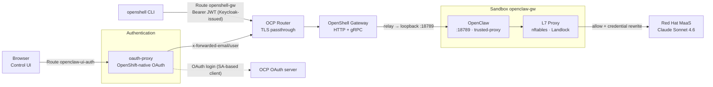
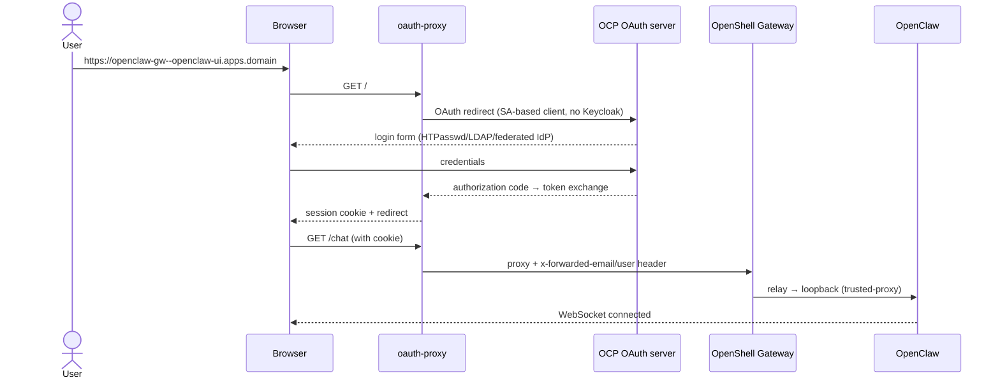

# OpenClaw in OpenShell

OpenClaw runs **inside** an OpenShell sandbox on OpenShift (Pattern A, [ADR-0007](docs/adrs/ADR-0007-openclaw-inside-sandbox.md)), with inference via Red Hat MaaS (LiteLLM) and browser login through OpenShift's own native OAuth server ([ADR-0016](docs/adrs/ADR-0016-openshift-native-oauth-spike.md); no Keycloak in this path). Keycloak remains deployed only as the OIDC issuer for the CLI/gRPC gateway auth path.

Supports both AWS OCP clusters and local CRC (CodeReady Containers / OpenShift Local) for development.

## Architecture

Pattern A: OpenClaw runs **inside** the sandbox. Only the OpenShell gateway is exposed; all egress goes through the sandbox L7 proxy (default-deny).

### Data plane



### Identity (OAuth)



### Request paths

| Path | Flow |
|------|------|
| **Control UI** | Browser → oauth-proxy (OpenShift-native OAuth) → Route → Gateway → sandbox `:18789` (trusted-proxy, `x-forwarded-email`) |
| **CLI / gRPC** | CLI → Route `openshell-gw` → Gateway (OIDC JWT, issued by Keycloak) → sandbox lifecycle / SSH relay |
| **Login** | Browser → oauth-proxy → OCP OAuth server → session cookie (see [ADR-0016](docs/adrs/ADR-0016-openshift-native-oauth-spike.md)) |
| **Inference** | OpenClaw → L7 proxy → MaaS (`openshell:resolve:env:LITELLM_API_KEY` rewritten; never on disk) |

### Security posture

| Layer | Mechanism |
|-------|-----------|
| Identity (browser) | OpenShift-native OAuth via SA-based client; `allowUnauthenticatedUsers: false` ([ADR-0016](docs/adrs/ADR-0016-openshift-native-oauth-spike.md)) |
| Identity (CLI/gRPC) | Keycloak OIDC broker → OCP credentials, still required for JWT/JWKS validation ([ADR-0010](docs/adrs/ADR-0010-oidc-ocp-federation.md)) |
| Browser auth | oauth-proxy OAuth session; unauthenticated requests redirect to the OCP OAuth server ([ADR-0011](docs/adrs/ADR-0011-oauth2-proxy-ui-auth.md) superseded by [ADR-0016](docs/adrs/ADR-0016-openshift-native-oauth-spike.md)) |
| Transport | Server TLS + passthrough Routes; mTLS remains load-bearing for sandbox internals ([ADR-0008](docs/adrs/ADR-0008-deployment-findings.md)) |
| Isolation | Sandbox netns + nftables + Landlock; process runs as `sandbox` user |
| Network | Default-deny; only MaaS endpoint allowed (`policies/openclaw-sandbox.yaml`) |
| OpenClaw | `auth.mode: trusted-proxy`, `bind: loopback`, `tools.deny` for control-plane tools, HTTP chatCompletions disabled ([ADR-0012](docs/adrs/ADR-0012-trusted-proxy-auth.md)) |
| Platform | Privileged SCC scoped only to `openshell-sandbox` SA ([ADR-0006](docs/adrs/ADR-0006-scc-privileged-sandbox.md)) |

### Why no gateway token?

The OpenClaw gateway uses `auth.mode: trusted-proxy` instead of a static token. See [ADR-0012](docs/adrs/ADR-0012-trusted-proxy-auth.md) for the full rationale. In summary: the token was a shared static secret that added friction without meaningful security, since outer layers already protect access (network namespace isolation, OpenShell mTLS+OIDC, oauth-proxy OAuth session).

## Quick start

```bash
# 1. Prerequisites (namespace, Agent Sandbox operator, SCC, JWT secret)
./scripts/bootstrap-ocp.sh

# 2. Secrets: copy template and set MAAS_API_KEY
cp secrets/secrets.template.env secrets/secrets.env

# 3. Deploy OpenShell gateway + Route + MaaS provider
./scripts/deploy-openshell.sh

# 4. Keycloak OIDC + OCP federation (CLI/gRPC gateway auth only, see ADR-0016)
./scripts/deploy-keycloak.sh
./scripts/configure-oidc.sh

# 5. oauth-proxy for browser SSO (OpenShift-native OAuth, no Keycloak)
./scripts/deploy-oauth2-proxy.sh

# 6. Launch OpenClaw sandbox, policy, Control UI Route
./scripts/launch-openclaw.sh

# 7. Deploy observability stack (Tempo, OTel Collector, MLflow)
./scripts/deploy-observability.sh

# 8. Verify everything (infra → gateway → sandbox → security → OIDC → observability → UI)
./scripts/verify.sh
```

If the gateway TLS cert was created before the wildcard SAN, regenerate once:

```bash
./scripts/upgrade-pki.sh
```

Teardown: `./scripts/teardown.sh`

### CRC (local development)

The same scripts work on CRC. The `APPS_DOMAIN` is auto-detected (`apps-crc.testing` for CRC, configurable for AWS). All templates are rendered via `__APPS_DOMAIN__` placeholders.

```bash
# Start CRC with enough resources
crc start -c 6 -m 16384 -d 60
eval $(crc oc-env)
oc login -u kubeadmin -p $(crc console --credentials | grep kubeadmin | awk -F"'" '{print $2}')

# Then follow the same quick start steps above
```

## Browser access

```
https://openclaw-gw--openclaw-ui.<APPS_DOMAIN>/
```

Login with any OpenShift cluster identity (HTPasswd, LDAP, or a federated corporate IdP) — authenticated directly against OCP's own OAuth server, no Keycloak involved ([ADR-0016](docs/adrs/ADR-0016-openshift-native-oauth-spike.md)). No token needed.

The hostname is uglier than a plain `openclaw-ui.<domain>` on purpose: it
must equal OpenShell's `{sandbox}--{service}` service-routing pattern to
work around a WebSocket Host-header bug in the `openshift/oauth-proxy` fork
(see ADR-0016). There is no unauthenticated fallback route anymore — this is
the only Kubernetes-level entry point onto the Control UI.

## Repository layout

| Path | Purpose |
|------|---------|
| `charts/openshell/values-ocp.yaml.tpl` | Helm overrides template (OIDC, PKI SANs, no GPU) |
| `config/openclaw.json.tpl` | OpenClaw config template (trusted-proxy auth, MaaS provider) |
| `policies/openclaw-sandbox.yaml` | Sandbox FS + network policy (MaaS allow) |
| `manifests/` | Routes, Keycloak (CLI/gRPC OIDC only), oauth-proxy (browser OAuth), observability, Agent Sandbox pin |
| `scripts/` | Bootstrap → deploy → launch → verify → teardown |
| `tests/` | Playwright E2E tests (UI + sandbox security) with OIDC auth |
| `docs/adrs/` | Architecture Decision Records |
| `ROADMAP.md` | Phased deployment status and pinned versions |
| `AGENTS.md` | Team roles and security guidelines |

## Testing

The Playwright test suite validates the full user flow through OpenShift-native OAuth authentication:

```bash
cd tests && npm install && npx playwright install chromium
OPENCLAW_BASE_URL="https://openclaw-gw--openclaw-ui.<APPS_DOMAIN>" npx playwright test
```

Tests are organized in three projects:
1. **auth-setup**: Automated OCP OAuth login (HTPasswd form), saves browser session
2. **ui-tests**: Control UI functionality (health, navigation, chat E2E via MaaS)
3. **security-tests**: Sandbox isolation (egress blocking, credential protection, privilege escalation, tool policy enforcement)

## Pinned versions

See [ROADMAP.md](ROADMAP.md) for the current pin table (OpenShell chart/gateway, Agent Sandbox operator, community OpenClaw image).

## References

- [ROADMAP.md](ROADMAP.md) — deployment phases and verification status
- [AGENTS.md](AGENTS.md) — roles and security baseline
- ADRs: [0001](docs/adrs/ADR-0001-helm-local-no-gpu.md) Helm/no GPU · [0007](docs/adrs/ADR-0007-openclaw-inside-sandbox.md) Pattern A · [0008](docs/adrs/ADR-0008-deployment-findings.md) TLS · [0009](docs/adrs/ADR-0009-external-service-routing.md) UI Route · [0010](docs/adrs/ADR-0010-oidc-ocp-federation.md) OIDC (CLI/gRPC) · [0011](docs/adrs/ADR-0011-oauth2-proxy-ui-auth.md) oauth2-proxy (superseded) · [0012](docs/adrs/ADR-0012-trusted-proxy-auth.md) trusted-proxy auth · [0016](docs/adrs/ADR-0016-openshift-native-oauth-spike.md) OpenShift-native OAuth (browser UI, current)
- [OpenShell on OpenShift](https://docs.nvidia.com/openshell/kubernetes/openshift)
- [OpenClaw LiteLLM provider](https://docs.openclaw.ai/providers/litellm)
