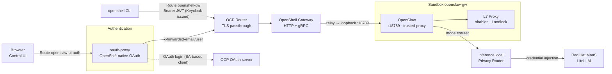
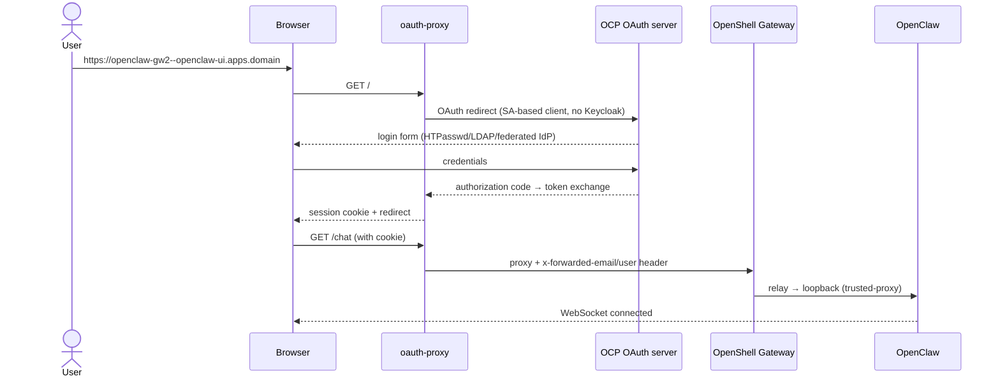
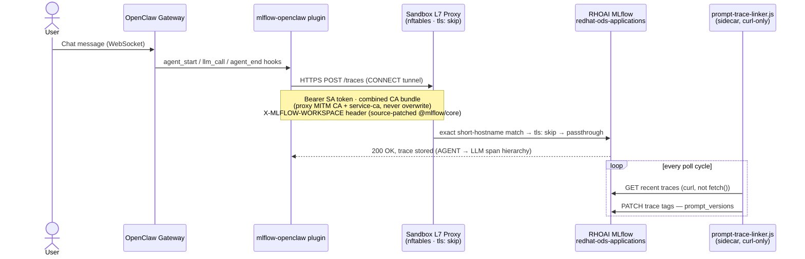
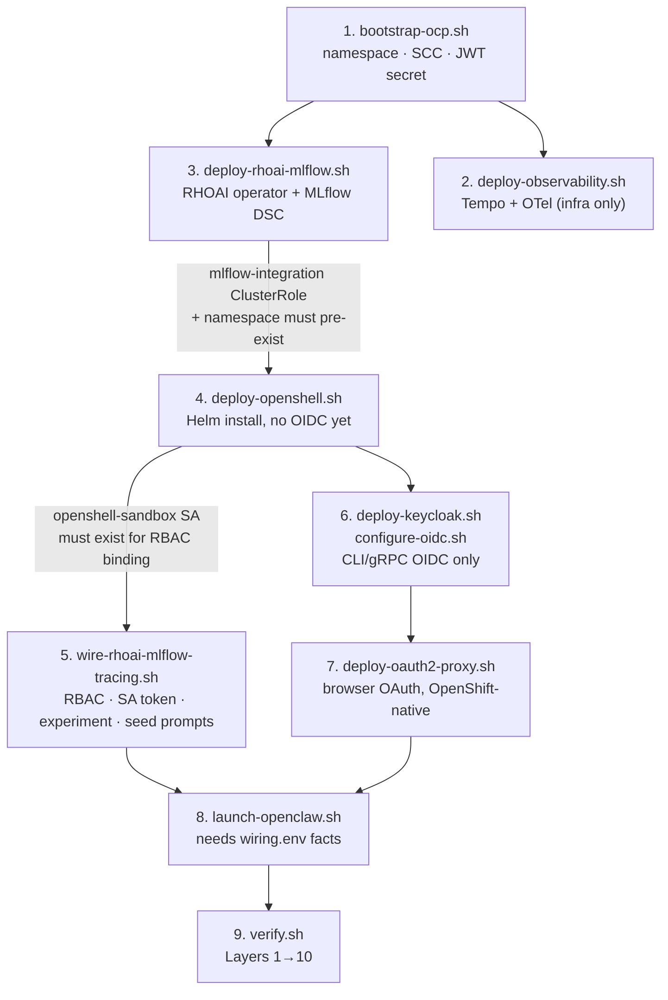

# OpenClaw in OpenShell

OpenClaw runs **inside** an OpenShell sandbox on OpenShift (Pattern A, [ADR-0007](docs/adrs/ADR-0007-openclaw-inside-sandbox.md)), with inference routed through OpenShell's `inference.local` privacy router ([ADR-0021](docs/adrs/ADR-0021-inference-router-migration.md)) to Red Hat MaaS (LiteLLM), and browser login through OpenShift's own native OAuth server ([ADR-0016](docs/adrs/ADR-0016-openshift-native-oauth-spike.md); no Keycloak in this path). Keycloak remains deployed only as the OIDC issuer for the CLI/gRPC gateway auth path.

Supports both AWS OCP clusters and local CRC (CodeReady Containers / OpenShift Local) for development.

## Architecture

Pattern A: OpenClaw runs **inside** the sandbox. Only the OpenShell gateway is exposed; all egress goes through the sandbox L7 proxy (default-deny).

### Data plane



### Identity (OAuth)



### Request paths

| Path | Flow |
|------|------|
| **Control UI** | Browser → oauth-proxy (OpenShift-native OAuth) → Route → Gateway → sandbox `:18789` (trusted-proxy, `x-forwarded-email`) |
| **CLI / gRPC** | CLI → Route `openshell-gw` → Gateway (OIDC JWT, issued by Keycloak) → sandbox lifecycle / SSH relay |
| **Login** | Browser → oauth-proxy → OCP OAuth server → session cookie (see [ADR-0016](docs/adrs/ADR-0016-openshift-native-oauth-spike.md)) |
| **Inference** | OpenClaw → `inference.local` (privacy router) → MaaS (credential injection at gateway layer; `apiKey: "unused"` in sandbox config — see [ADR-0021](docs/adrs/ADR-0021-inference-router-migration.md)) |

### Security posture

| Layer | Mechanism |
|-------|-----------|
| Identity (browser) | OpenShift-native OAuth via SA-based client; `allowUnauthenticatedUsers: false` ([ADR-0016](docs/adrs/ADR-0016-openshift-native-oauth-spike.md)) |
| Identity (CLI/gRPC) | Keycloak OIDC broker → OCP credentials, still required for JWT/JWKS validation ([ADR-0010](docs/adrs/ADR-0010-oidc-ocp-federation.md)) |
| Browser auth | oauth-proxy OAuth session; unauthenticated requests redirect to the OCP OAuth server ([ADR-0011](docs/adrs/ADR-0011-oauth2-proxy-ui-auth.md) superseded by [ADR-0016](docs/adrs/ADR-0016-openshift-native-oauth-spike.md)) |
| Transport | Server TLS + passthrough Routes; mTLS remains load-bearing for sandbox internals ([ADR-0008](docs/adrs/ADR-0008-deployment-findings.md)) |
| Isolation | Sandbox netns + nftables + Landlock; process runs as `sandbox` user |
| Network | Default-deny; only MaaS endpoint allowed (`policies/openclaw-sandbox.yaml`) |
| OpenClaw | `auth.mode: trusted-proxy`, `bind: loopback`, `tools.deny` for control-plane tools, HTTP chatCompletions disabled ([ADR-0012](docs/adrs/ADR-0012-trusted-proxy-auth.md)) |
| Platform | Privileged SCC scoped only to `openshell-sandbox` SA ([ADR-0006](docs/adrs/ADR-0006-scc-privileged-sandbox.md)) |

### Why no gateway token?

The OpenClaw gateway uses `auth.mode: trusted-proxy` instead of a static token. See [ADR-0012](docs/adrs/ADR-0012-trusted-proxy-auth.md) for the full rationale. In summary: the token was a shared static secret that added friction without meaningful security, since outer layers already protect access (network namespace isolation, OpenShell mTLS+OIDC, oauth-proxy OAuth session).

## Observability and tracing (RHOAI-managed MLflow)

Every chat turn is traced end-to-end into RHOAI's shared MLflow instance — the **sole** tracing and prompt-registry backend for this project ([ADR-0018](docs/adrs/ADR-0018-rhoai-mlflow-sole-backend.md), superseding the earlier standalone `ghcr.io/mlflow/mlflow` deployment). This wasn't a config-only integration: getting the `mlflow-openclaw` plugin to talk to RHOAI's TLS + auth-hardened MLflow through the sandbox's default-deny L7 proxy required three real source-level fixes, all now baked permanently into `scripts/launch-openclaw.sh` / `scripts/wire-rhoai-mlflow-tracing.sh`.



**Prompt registry, same backend**: 7 operator-controlled system prompts (`prompts/*.md`) are versioned in MLflow's Prompt Registry with a `@production` alias ([ADR-0015](docs/adrs/ADR-0015-mlflow-prompt-registry.md)). `launch-openclaw.sh` fetches them into the sandbox at every launch, locks them `root:root chmod 444` (agent cannot self-modify its own instructions), and `prompt-trace-linker.js` tags every trace with the exact prompt versions active when it ran — full three-layer traceability (per-trace content hash, per-deployment experiment tag, per-trace linker tag). Rollback is a one-click alias move in the MLflow UI, no redeploy needed.

| Task | Command |
|------|---------|
| Edit prompts | Edit `prompts/*.md`, then `./scripts/prompt-registry/seed-mlflow-prompts.sh` |
| Deploy to sandbox | `./scripts/launch-openclaw.sh` (fetches automatically) |
| Browse traces/prompts | RHOAI Dashboard GenAI Studio (AWS only, `oc get route rhods-dashboard -n redhat-ods-applications`) or the MLflow Route directly (`oc get route mlflow -n redhat-ods-applications`) |
| Rollback a prompt | Move `@production` alias to a prior version in the MLflow UI, then relaunch |

Three non-obvious integration bugs were found and permanently fixed while wiring this — each is a pattern worth knowing before integrating *any* Node.js SDK through a similar egress proxy (full write-ups in `docs/constraints.md`):

| # | Symptom | Root cause | Fix |
|---|---------|------------|-----|
| [#4b](docs/constraints.md#4b-plugins--pinned-mlflowcore-misses-the-x-mlflow-workspace-fix-resolved-via-source-patch-backport) | `HTTP 400: Workspace context is required` | Pinned `@mlflow/core@0.2.0` predates the upstream `X-MLFLOW-WORKSPACE` header fix; `npm overrides` blocked by an unrelated registry policy | Source-patched the already-installed `dist/auth/index.js` to add the header from `process.env.MLFLOW_WORKSPACE` |
| [#4c](docs/constraints.md#4c-node_extra_ca_certs-is-single-value-must-be-extended-never-overwritten-resolved) | `SELF_SIGNED_CERT_IN_CHAIN`, then MaaS chat breaks too | `NODE_EXTRA_CA_CERTS` is single-value; pointing it at only the new CA silently dropped OpenShell's own proxy MITM CA | Concatenate both PEMs into one combined bundle, always point the env var at the union |
| [#4d](docs/constraints.md#4d-tls-skip-policy-endpoints-require-an-exact-hostname-string-match--fqdn-vs-short-service-name-silently-defeats-it) | `403` that looks identical to a TLS-trust failure | `tls: skip` policy matches the exact hostname string; FQDN (`...svc.cluster.local`) ≠ the policy's short `<svc>.<ns>.svc` form | Build every service URL that crosses the proxy using the exact hostname the policy is keyed on |

## Quick start

The easiest way to run all of this in the right order is
`./scripts/cluster-lifecycle.sh full` (see `./scripts/cluster-lifecycle.sh --help`).
The individual steps it orchestrates, for reference or manual/partial runs:

```bash
# 1. Prerequisites (namespace, Agent Sandbox operator, SCC, JWT secret)
./scripts/bootstrap-ocp.sh

# 2. Secrets: copy template and set MAAS_API_KEY
cp secrets/secrets.template.env secrets/secrets.env

# 3. Deploy RHOAI operator + a minimal MLflow-only DataScienceCluster — the
#    sole tracing/prompt-registry backend for this project (see
#    docs/adrs/ADR-0018-rhoai-mlflow-sole-backend.md). MUST run before
#    OpenShell (the mlflow-integration ClusterRole/namespace it wires RBAC to
#    must already exist).
./scripts/deploy-rhoai-mlflow.sh

# 4. Deploy OpenShell gateway + Route + MaaS provider
./scripts/deploy-openshell.sh

# 5. Wire RHOAI MLflow tracing: RBAC, SA token, experiment, CA staging, and
#    initial prompt seeding. MUST run after OpenShell (binds RBAC to the
#    openshell-sandbox ServiceAccount it creates).
./scripts/wire-rhoai-mlflow-tracing.sh

# 6. Keycloak OIDC + OCP federation (CLI/gRPC gateway auth only, see ADR-0016)
./scripts/deploy-keycloak.sh
./scripts/configure-oidc.sh

# 7. oauth-proxy for browser SSO (OpenShift-native OAuth, no Keycloak)
./scripts/deploy-oauth2-proxy.sh

# 8. Launch OpenClaw sandbox, policy, Control UI Route
./scripts/launch-openclaw.sh

# 9. Deploy infrastructure observability (Tempo, OTel Collector — logs/metrics
#    only; agent traces go exclusively to RHOAI MLflow from step 3/5 above)
./scripts/deploy-observability.sh

# 10. Verify everything (infra → gateway → sandbox → security → OIDC → RHOAI MLflow → observability → UI)
./scripts/verify.sh
```

### Deploy ordering (why the steps above are in this order)

The order is not arbitrary — each step binds RBAC or reads facts produced by an earlier one. Getting this wrong is the #1 source of confusing "not found" / "missing authorization" errors (see [`docs/constraints.md` #10](docs/constraints.md#10-deploy-ordering) for the full failure-mode catalog). `scripts/cluster-lifecycle.sh full` encodes exactly this graph:



If the gateway TLS cert was created before the wildcard SAN, regenerate once:

```bash
./scripts/upgrade-pki.sh
```

Teardown: `./scripts/teardown.sh`

### CRC (local development)

The same scripts work on CRC. The `APPS_DOMAIN` is auto-detected (`apps-crc.testing` for CRC, configurable for AWS). All templates are rendered via `__APPS_DOMAIN__` placeholders.

```bash
# Start CRC with enough resources — RHOAI (mandatory, ADR-0018) needs more
# than the pre-RHOAI baseline; 16 vCPU / 40 GiB is what's been empirically
# validated to fit the full stack, see docs/adrs/ADR-0017-rhoai-mlflow-scope.md
crc config set cpus 16
crc config set memory 40960
crc config set disk-size 100
crc start
eval $(crc oc-env)
oc login -u kubeadmin -p $(crc console --credentials | grep kubeadmin | awk -F"'" '{print $2}')

# Then follow the same quick start steps above (or just run
# ./scripts/cluster-lifecycle.sh full)
```

**Resource note (CRC only)**: running RHOAI+MLflow together with the rest of
the OpenClaw-in-OpenShell stack on a shared dev laptop can drop host-available
memory to ~11 GiB and engage swap — functionally fine (no crashes/evictions
observed), but tight. This is an accepted trade-off, not a bug — see
[ADR-0018](docs/adrs/ADR-0018-rhoai-mlflow-sole-backend.md)'s "Consequences".

## Browser access

```
https://openclaw-gw2--openclaw-ui.<APPS_DOMAIN>/
```

Login with any OpenShift cluster identity (HTPasswd, LDAP, or a federated corporate IdP) — authenticated directly against OCP's own OAuth server, no Keycloak involved ([ADR-0016](docs/adrs/ADR-0016-openshift-native-oauth-spike.md)). No token needed.

The hostname is uglier than a plain `openclaw-ui.<domain>` on purpose: it
must equal OpenShell's `{sandbox}--{service}` service-routing pattern to
work around a WebSocket Host-header bug in the `openshift/oauth-proxy` fork
(see ADR-0016). There is no unauthenticated fallback route anymore — this is
the only Kubernetes-level entry point onto the Control UI.

## Repository layout

| Path | Purpose |
|------|---------|
| `charts/openshell/` | OpenShell Helm chart overrides — `values-ocp.yaml.tpl` (OIDC, PKI SANs, no GPU) and `values-ocp-no-oidc.yaml.tpl` (bootstrap phase, before OIDC exists) |
| `charts/rhoai/` | Vendored, trimmed RHOAI Helm charts (`operators`, `platform`, `database`, `mlflow`) — RHOAI operator + minimal MLflow-only DataScienceCluster, the sole tracing/prompt-registry backend ([ADR-0018](docs/adrs/ADR-0018-rhoai-mlflow-sole-backend.md)); declarative RBAC + SA-token + experiment creation via Helm hook Jobs, no imperative `oc apply`/`oc create token` |
| `charts/agent-sandbox/` | Own, independent Helm chart (`operators/`) + Makefile for the Red Hat build of Agent Sandbox Operator (OLM `agent-sandbox-operator`, channel `preview-0.9`) on OCP/RHPDS — not shared with `agentops-example`'s equivalent chart ([ADR-0004](docs/adrs/ADR-0004-agent-sandbox-redhat.md)); CRC still uses the raw upstream manifest fallback in `manifests/` |
| `charts/keycloak/`, `charts/oauth2-proxy/`, `charts/observability/` | Helm charts (converted from sed-templated YAML) for the CLI/gRPC OIDC issuer, browser OAuth proxy, and infra logs/metrics (Tempo + OTel Collector) |
| `config/openclaw.json.tpl` | OpenClaw config template — `trusted-proxy` auth, MaaS provider, `mlflow-openclaw` plugin, `tools.deny`/`plugins.deny` hardening |
| `policies/openclaw-sandbox.yaml` | Sandbox FS + network policy (default-deny; MaaS allow; RHOAI MLflow `tls: skip`, exact-hostname-matched) |
| `manifests/` | Plain manifests that aren't full charts: OpenShell Route; Agent Sandbox upstream pin (`agent-sandbox-v0.5.1.yaml`) kept as CRC-only OLM fallback |
| `prompts/` | 7 operator-controlled system prompt files (`AGENTS`, `SOUL`, `TOOLS`, `IDENTITY`, `USER`, `HEARTBEAT`, `BOOTSTRAP`), versioned in MLflow's Prompt Registry |
| `scripts/` | Bootstrap → deploy → wire → launch → verify → teardown; `cluster-lifecycle.sh` orchestrates the full graph; `common.sh` holds shared helpers (env detection, secret rendering, retries) |
| `scripts/prompt-registry/` | Self-contained prompt versioning + trace-linking subsystem (seed, fetch, `prompt-trace-linker.js` sidecar) — its own `README.md` |
| `tests/` | Playwright E2E suite: OIDC/OAuth login setup, Control UI chat, sandbox security, MLflow UI/trace validation |
| `docs/adrs/` | Architecture Decision Records — the "why", one file per decision, superseded ones kept (not deleted) for history |
| `docs/constraints.md` | **20 real production constraints** hit while building this — each with symptom, root cause, and fix. The single best "lessons learned" reference in the repo (see below) |
| `docs/reports/` | Point-in-time investigation write-ups (e.g. trace duplication) |
| `secrets/secrets.template.env` | Template for local secrets (`MAAS_API_KEY` etc.) — never commit the real `secrets.env` |
| `.cursor/skills/` | Cursor agent skills for this repo: `deploy-full` (one-command deploy), `crc-local-dev`, `monitor-deployment`, `adr`, `no-secrets`, `document-feature`, `create-pr` |
| `.cursor/rules/` | Always-on governance for AI assistants: `adr-alignment`, `documentation-sources`, `no-secrets`, `technology-usage-docs` |
| `ROADMAP.md` | Phased deployment status, task-level history, and pinned versions |
| `AGENTS.md` | Team roles and security guidelines |

## Testing

The Playwright test suite validates the full user flow through OpenShift-native OAuth authentication:

```bash
cd tests && npm install && npx playwright install chromium
OPENCLAW_BASE_URL="https://openclaw-gw2--openclaw-ui.<APPS_DOMAIN>" npx playwright test
```

Tests are organized in four projects, run in dependency order:
1. **auth-setup** (`auth.setup.ts`): Automated OCP OAuth login (HTPasswd form), saves browser session
2. **ui-tests** (`openclaw-ui.spec.ts`): Control UI functionality (health, navigation, chat E2E via MaaS)
3. **security-tests** (`sandbox-security.spec.ts`): Jailbreak/exfiltration resistance via chat — credential leak, gateway tool denial, config.patch social engineering, egress/sudo/IMDS/shadow (complements deterministic checks in `verify.sh` Layer 4)
4. **mlflow-ui-tests** (`mlflow-ui.spec.ts`): RHOAI MLflow UI — GenAI Studio Prompts tab, Traces tab, and the "Prompt" column showing linked prompt versions (runs after the chat E2E test so a real trace exists to assert against)

`scripts/verify.sh` runs a broader, non-browser check across 10 layers (infra → gateway → sandbox → security → OIDC → RHOAI MLflow → observability → UI → prompt/trace linkage) and is what `cluster-lifecycle.sh full` calls automatically at the end of a deploy.

## Lessons learned — patterns worth reusing in other projects

This project accumulated a lot of hard-won, non-obvious findings while running an agent gateway inside a sandboxed, default-deny network. `docs/constraints.md` is the canonical, detailed log (20 numbered constraints, each with symptom → root cause → fix). The table below is a map into it — read the full entry for anything that looks relevant to a project you're building:

| Pattern | Problem it solves | Details |
|---------|-------------------|---------|
| `trusted-proxy` auth instead of a static gateway token | Removes a shared static secret from the attack surface; outer layers (netns isolation, mTLS/OIDC, OAuth session) already authenticate | [ADR-0012](docs/adrs/ADR-0012-trusted-proxy-auth.md) |
| OpenShift-native OAuth (`oauth-proxy` fork) for browser SSO instead of a separate IdP | One less moving part for human login; OCP is already the identity source of truth | [ADR-0016](docs/adrs/ADR-0016-openshift-native-oauth-spike.md) |
| Route hostname must equal the service-routing pattern (`{sandbox}--{service}`) | A WebSocket Host-header bug in the OAuth proxy fork silently breaks chat logins otherwise | [ADR-0016](docs/adrs/ADR-0016-openshift-native-oauth-spike.md) "WebSocket login failure" |
| Allowlist every binary path a version manager might install to (e.g. both `/usr/bin/node` and `/usr/local/bin/node`) | L7 proxies that resolve `/proc/<pid>/exe` silently deny traffic if a tool (like `n`) relocates the binary | [constraints.md #2](docs/constraints.md#2-networking--l7-binary-path-enforcement-resolved-via-policy) |
| Use the consuming app's OWN native env-backed SecretRef syntax instead of a sandbox-proxy credential-injection mechanism | Node's `fetch()`/`undici` creates ephemeral connections the proxy can't reliably attribute to a PID, breaking HTTP-layer credential injection; resolving in-process before the request is built sidesteps that class of problem entirely, and gets automatic exact-value redaction as a bonus | [constraints.md #3](docs/constraints.md#3-networking--nodejs-fetch-and-proxy-credential-injection-resolved-via-openclaw-native-secretref) |
| Combine CA bundles, never overwrite a single-value trust env var (`NODE_EXTRA_CA_CERTS`) | Multiple independent TLS trust needs (proxy MITM CA + a real service CA) collide on the same env var | [constraints.md #4c](docs/constraints.md#4c-node_extra_ca_certs-is-single-value-must-be-extended-never-overwritten-resolved) |
| Match `tls: skip` / per-host policy entries by the *exact* hostname string used in code | FQDN vs. short Kubernetes Service DNS form looks identical to a TLS failure but is actually a policy-matching miss | [constraints.md #4d](docs/constraints.md#4d-tls-skip-policy-endpoints-require-an-exact-hostname-string-match--fqdn-vs-short-service-name-silently-defeats-it) |
| Source-patch a pinned dependency file directly when `npm overrides`/upgrades are blocked | Registry-level `policy_denied` on a specific package/version can block the "proper" fix; patching the already-installed file sidesteps it entirely | [constraints.md #4b](docs/constraints.md#4b-plugins--pinned-mlflowcore-misses-the-x-mlflow-workspace-fix-resolved-via-source-patch-backport) |
| Use `curl`/`execFileSync` instead of `fetch()` for sidecar HTTP inside the same sandbox | Same root cause as #3 — ephemeral Node connections aren't reliably attributable by the proxy, but `curl` is a stable, allowlisted binary | [constraints.md #8](docs/constraints.md#8-sidecar-communication--curl-vs-fetch) |
| Start loopback-bound service processes via a sandbox-namespace exec path, not the container's root namespace | A service relay tunneling through the sandbox network namespace can't reach a process bound to `127.0.0.1` in a *different* namespace | [constraints.md #11](docs/constraints.md#11-network-namespace--process-start-location) |
| Check current state before touching cert/registration state on every re-deploy | Unconditionally rewriting mTLS client certs on every `helm upgrade` invalidates cached credentials and forces slow, flaky re-registration even when nothing changed | [constraints.md #19](docs/constraints.md#19-openshell-status-fails-mtls-handshake-for-several-minutes-after-helm-upgrade-of-the-openshell-chart) |
| Scope narrow env-var workarounds to the exact flow that needs them | A global `OPENSHELL_GATEWAY_INSECURE=true` fixed OIDC token refresh on CRC but silently broke unrelated mTLS registration | [ROADMAP.md 13.5](ROADMAP.md#135-re-audit-openshell_gateway_insecure-scoping-when-aws-ocp-gets-real-certs), [constraints.md #18](docs/constraints.md#18-openshell-cli-oidc-token-refresh-fails-on-crc--self-signed-router-ca-not-in-system-trust-store) |
| Declarative RBAC/experiment/token provisioning via Helm hook Jobs, not imperative `oc apply`/`oc create token` scripts | Reproducible, diffable, survives `helm upgrade` cleanly | `charts/rhoai/mlflow/templates/` |

If you're integrating any Node.js-based agent/SDK through a similar egress-restricted sandbox proxy, constraints **#2, #3, #4b–#4e, and #8** above are the ones most likely to bite first — they're all variations of "the proxy can't reliably identify which process/binary is making this specific connection."

## Pinned versions

See [ROADMAP.md](ROADMAP.md) for the current pin table (OpenShell chart/gateway, Agent Sandbox operator, community OpenClaw image).

## References

- [ROADMAP.md](ROADMAP.md) — deployment phases, task-level history, and pinned versions
- [AGENTS.md](AGENTS.md) — roles and security baseline
- [docs/constraints.md](docs/constraints.md) — 20 production constraints (symptom → root cause → fix); the deepest "how this actually works" reference
- ADRs: [0001](docs/adrs/ADR-0001-helm-local-no-gpu.md) Helm/no GPU · [0002](docs/adrs/ADR-0002-openclaw-in-sandbox.md) OpenClaw in sandbox · [0003](docs/adrs/ADR-0003-secret-management.md) Secret management · [0004](docs/adrs/ADR-0004-agent-sandbox-redhat.md) Agent Sandbox Operator (OLM `agent-sandbox-operator`, OSC 1.13) · [0005](docs/adrs/ADR-0005-maas-inference-provider.md) MaaS provider · [0006](docs/adrs/ADR-0006-scc-privileged-sandbox.md) Privileged SCC · [0007](docs/adrs/ADR-0007-openclaw-inside-sandbox.md) Pattern A · [0008](docs/adrs/ADR-0008-deployment-findings.md) TLS · [0009](docs/adrs/ADR-0009-external-service-routing.md) UI Route · [0010](docs/adrs/ADR-0010-oidc-ocp-federation.md) OIDC (CLI/gRPC) · [0011](docs/adrs/ADR-0011-oauth2-proxy-ui-auth.md) oauth2-proxy (superseded) · [0012](docs/adrs/ADR-0012-trusted-proxy-auth.md) trusted-proxy auth · [0014](docs/adrs/ADR-0014-agent-observability.md) Observability (Tempo/OTel, MLflow half superseded) · [0015](docs/adrs/ADR-0015-mlflow-prompt-registry.md) Prompt registry (backend superseded, mechanism current) · [0016](docs/adrs/ADR-0016-openshift-native-oauth-spike.md) OpenShift-native OAuth (browser UI, current) · [0017](docs/adrs/ADR-0017-rhoai-mlflow-scope.md) RHOAI MLflow empirical validation (superseded) · [0018](docs/adrs/ADR-0018-rhoai-mlflow-sole-backend.md) RHOAI MLflow sole backend (current) · [0019](docs/adrs/ADR-0019-declarative-openshell-wrapper-chart.md) Declarative OpenShell wrapper chart (current) · [0020](docs/adrs/ADR-0020-shared-cluster-coexistence.md) Shared-cluster coexistence with agentops-example (current)
- [OpenShell on OpenShift](https://docs.nvidia.com/openshell/kubernetes/openshift)
- [OpenClaw LiteLLM provider](https://docs.openclaw.ai/providers/litellm)
