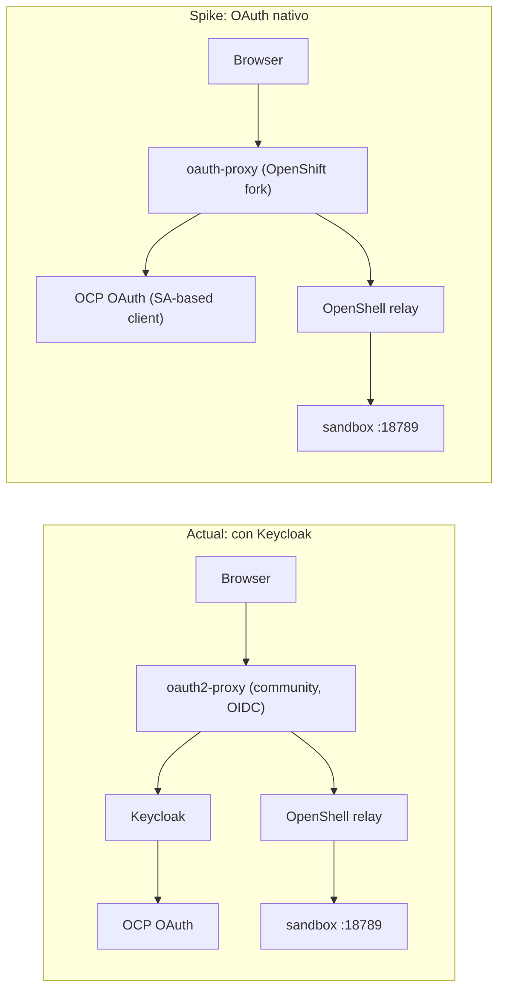

# ADR-0016: OpenShift-Native OAuth Instead of Keycloak (Browser UI)

## Status

**Accepted and deployed to production (browser UI path only), fully verified
end to end including WebSocket chat.** The production Route
`openclaw-ui-auth` (`openclaw-gw--openclaw-ui.<APPS_DOMAIN>`, previously the
friendlier `openclaw-ui.<APPS_DOMAIN>` — see "WebSocket login failure" below
for why it changed) now points at `oauth-proxy` (OpenShift fork, SA-based
OAuth client) instead of the community `oauth2-proxy` + Keycloak stack.
Browsers authenticate directly against OCP's own OAuth server; zero Keycloak
involvement in this path. The full Playwright suite
(`tests/openclaw-ui.spec.ts`), including a live chat round-trip over
WebSocket through `oauth-proxy` to Claude via MaaS, passes against this
config — see "WebSocket login failure" for the three coupled bugs (one real
upstream proxy bug, two self-inflicted during rollout) that had to be fixed
before this was true.
`manifests/oauth2-proxy/` (the canonical, deployed manifests) and
`scripts/deploy-oauth2-proxy.sh` were updated in place to this effect; the
former Keycloak-brokered `oauth2-proxy` Deployment/Service/Route/ConfigMap
and the side-by-side `manifests/oauth2-proxy-openshift-native/` spike
directory were both retired/folded in — see "Rollout" below.

**Keycloak itself is intentionally still deployed.** It remains the OIDC
issuer for the separate CLI/gRPC gateway auth path
(`scripts/configure-oidc.sh`, `charts/openshell/values-ocp.yaml.tpl`
`server.oidc`). That path requires a real JWKS-serving OIDC provider with a
`realm_access.roles` JWT claim for admin/user role mapping — a Keycloak-
specific claim shape that OCP's native OAuth server does not produce (OCP's
OAuth server is OAuth 2.0, not a standards-compliant OIDC provider with
ID tokens / JWKS in the shape the gateway validates). Retiring Keycloak
entirely would require the OpenShell gateway to support an alternative
token-validation mechanism (e.g. Kubernetes TokenReview/SubjectAccessReview)
that does not currently exist. This was investigated in full and closed as a
decision (not left open) — see "Decision record: Keycloak stays, scoped to
the CLI/gRPC path" below.

## Context

`ROADMAP.md` Phase 13.1 flagged eliminating Keycloak as a possible
simplification, but left it blocked: it was unclear whether OpenShift's OAuth
server tolerates the topology used here —
`Browser → oauth2-proxy → OpenShell relay (mTLS) → sandbox loopback gateway`
— since Keycloak was originally introduced as an identity **broker** in front
of OCP OAuth (see [ADR-0010](ADR-0010-oidc-ocp-federation.md) and
[ADR-0011](ADR-0011-oauth2-proxy-ui-auth.md)), not because OCP OAuth itself
was unusable directly.

`sallyom/claw-installer`'s OpenShift provider plugin authenticates browsers
with an `oauth-proxy` sidecar using `-provider=openshift` and a
`ServiceAccount`-based OAuth client (via the `TokenRequest` API and the
`oauth-redirectreference` annotation) — no Keycloak, no cluster-scoped
`OAuthClient`. That pattern is the target of this spike.

### Correction versus the original plan wording

The plan for this work said "cambiar su `--provider` de `oidc` a `openshift`"
on the existing `oauth2-proxy` deployment. On inspection of
[manifests/oauth2-proxy/deployment.yaml](../../manifests/oauth2-proxy/deployment.yaml),
this repo runs the **community** `quay.io/oauth2-proxy/oauth2-proxy` image
(`v7.15.3`). That image's provider list (google, github, gitlab, oidc, azure,
keycloak-oidc, ...) has **no `openshift` provider** — that provider only
exists in the separate, Red-Hat-maintained `openshift/oauth-proxy` fork
(image stream `oauth-proxy` in the `openshift` namespace /
`registry.redhat.io/openshift4/ose-oauth-proxy`), which is what
`claw-installer` actually deploys. The corrected spike therefore introduces
this second binary as an alternative, not a flag change on the existing one.

## Decision

Originally validated as a parallel auth path before promotion to production
(historical framing below kept for context); it is now the sole browser auth
path in `manifests/oauth2-proxy/`:



Artifacts live under
[manifests/oauth2-proxy/](../../manifests/oauth2-proxy/) (originally staged
side by side under a now-retired `oauth2-proxy-openshift-native/` directory
during validation, then folded in as canonical — see "Rollout" below):

- `serviceaccount.yaml` — SA with `oauth-redirectreference.primary`
  annotation, replacing `manifests/keycloak/oauthclient.yaml`'s cluster-scoped
  `OAuthClient`.
- `deployment.yaml` — `oauth-proxy` (OpenShift fork) container fronting the
  **same** OpenShell relay upstream
  (`https://openclaw-gw--openclaw-ui.__APPS_DOMAIN__`) as before, so the auth
  hop was the only variable under test during validation.
- `service.yaml` — carries `service.beta.openshift.io/serving-cert-secret-name`
  so the service CA issues the TLS cert `oauth-proxy` terminates itself.
- `route.yaml.tpl` — the production Route `openclaw-ui-auth`
  (`openclaw-ui.__APPS_DOMAIN__` during this initial spike; changed to
  `openclaw-gw--openclaw-ui.__APPS_DOMAIN__` by the WebSocket fix below),
  `reencrypt` termination.

This mirrors the ownership boundary already established in ADR-0012:
`userHeader` stays `x-forwarded-email` (or whatever header is proven to
carry a usable identity in step 3 below), and `allowLoopback` /
`trustedProxies` in
[config/openclaw.json.tpl](../../config/openclaw.json.tpl) are unaffected —
only the identity provider in front of the relay changes.

## Validation evidence (live, CRC cluster, 2026-07-22)

Ran against the actual running `openshell` namespace (pods `openclaw-gw`,
`openshell-0`, `oauth2-proxy` already `Ready`) — `.deploy-state.json` was
stale/inaccurate; a real cluster was in fact available.

Deployed the manifests under a (since-retired, now folded into
`manifests/oauth2-proxy/`) `manifests/oauth2-proxy-openshift-native/`
directory, alongside the production Keycloak Route (different hostname
`openclaw-ui-native.apps-crc.testing`, no disruption to `openclaw-ui-auth`).
Scripted the full authorization-code flow with `curl` against the `developer`
HTPasswd user (login form → CSRF token → consent/approve page → code →
`oauth-proxy` callback → protected upstream), the same flow a browser
performs. Result: **HTTP 200 with the real `OpenClaw Control` HTML**, plus
`gap-auth: developer@cluster.local` confirming `oauth-proxy` resolved a
per-user identity (OpenShift's HTPasswd IDP has no email attribute for this
user, so it synthesizes `<username>@cluster.local` — real IdPs with email
claims would produce a real address).

Two real defects were found and fixed while getting there (not
hypothetical — both reproduced with concrete error output):

1. **`--ssl-upstream-insecure-skip-verify` does not exist** in the
   `openshift/oauth-proxy` fork (only in community `oauth2-proxy`). Using the
   fork's only related flag, `--ssl-insecure-skip-verify`, did **not** apply
   to the upstream reverse-proxy connection — the pod logs showed
   `tls: failed to verify certificate: x509: certificate signed by unknown
   authority` and the Route returned `502 Bad Gateway`. **Fix**: mount
   `openshell-server-tls`'s `ca.crt` (the CA that signs the OpenShell relay's
   passthrough-TLS cert) into the pod and pass `--upstream-ca=/etc/openshell/ca.crt`.
   See `deployment.yaml`'s `openshell-ca` volume.
2. **`-pass-host-header` defaults to `true`** in this fork (opposite of the
   community `oauth2-proxy`'s `pass_host_header = false` already used in
   production). With the default, `oauth-proxy` forwarded the *inbound*
   `Host` header (`openclaw-ui-native.apps-crc.testing`) to the upstream
   instead of rewriting it to the upstream URL's host
   (`openclaw-gw--openclaw-ui.apps-crc.testing`). OpenShell's host-based
   sandbox/service routing
   ([`crates/openshell-server/src/service_routing.rs`](../../../OpenShell/crates/openshell-server/src/service_routing.rs)
   `parse_host`) then parsed a nonexistent sandbox named
   `openclaw-ui-native` and returned `404 Service endpoint not found` — a
   real, reproducible OpenShell-relay-level rejection, not a hypothetical
   one. **Fix**: explicit `--pass-host-header=false`.

Both fixes are already applied in `deployment.yaml`, so anyone re-running
this on a fresh cluster gets a working deployment on the first try.

### Open questions from the original spike (still open)

1. **Access scope.** The default `-provider=openshift` with no
   `-openshift-sar` authenticates *any* cluster user with a valid OCP
   identity (proven: `developer` needed no special role). Confirm whether
   that matches the intended access model, or whether a SAR restriction
   (e.g. `get` on the `openshell` namespace) should be added —
   `claw-installer` does not appear to restrict this either, so parity is not
   automatically "secure enough" for this project's threat model. Not
   blocking for this rollout (matches the prior Keycloak setup's access
   model, which also had no equivalent restriction), but worth a follow-up.
2. **Real IdP email claims.** This cluster only has the HTPasswd IDP
   (synthesized `@cluster.local` email). A production OCP cluster with a real
   IdP (LDAP, GitHub, OIDC-federated corporate IdP) should be re-verified to
   confirm `x-forwarded-email` carries a real, human-readable address rather
   than the synthesized fallback — `userHeader` in
   [config/openclaw.json.tpl](../../config/openclaw.json.tpl) assumes a
   human-readable audit identity (ADR-0012).
3. **Cookie/session behavior across the passthrough-TLS Route** used for the
   CLI path was not touched by this change (browser path only).

## Rollout to production (2026-07-23)

The browser UI path described above was cut over to production:

1. `manifests/oauth2-proxy/` (previously the community `oauth2-proxy` +
   Keycloak stack) now contains the `oauth-proxy` manifests instead:
   `serviceaccount.yaml`, `service.yaml`, `deployment.yaml`, and
   `route.yaml.tpl` (Route `openclaw-ui-auth`, initially host
   `openclaw-ui.__APPS_DOMAIN__`, `reencrypt` termination, pointing at the
   `oauth-proxy` Service; changed to `openclaw-gw--openclaw-ui.__APPS_DOMAIN__`
   the same day by the WebSocket fix below). The SA's
   `oauth-redirectreference.primary` annotation now references
   `openclaw-ui-auth` (was `openclaw-ui-native` during validation). The old
   community-`oauth2-proxy`-specific `configmap.yaml`/`.tpl` and `route.yaml`
   were deleted; the temporary `manifests/oauth2-proxy-openshift-native/`
   spike directory was removed (folded into `manifests/oauth2-proxy/`).
2. `scripts/deploy-oauth2-proxy.sh` was rewritten: it no longer registers a
   Keycloak client or creates `oauth2-proxy-secrets`; it creates
   `oauth-proxy-session-secret` and applies the manifests above.
3. `scripts/common.sh`'s `render_all_templates` renders
   `manifests/oauth2-proxy/route.yaml.tpl` (was the Keycloak-config
   ConfigMap template, now removed).
4. `scripts/verify.sh` Layer 7b now checks the `oauth-proxy`
   Deployment/Route and drives a full authorization-code flow against the
   HTPasswd `developer` user (curl, no browser) as its own evidence, instead
   of checking for a Keycloak redirect. A new Layer 7c checks that Keycloak's
   OIDC discovery is still reachable, since it remains required for the
   CLI/gRPC path.
5. `tests/auth.setup.ts` now drives OCP's own login form
   (`#inputUsername`/`#inputPassword`/`#co-login-button`) instead of
   Keycloak's (`#username`/`#password`/`#kc-login`).
6. On the live CRC cluster: the old `oauth2-proxy` Deployment/Service and its
   `oauth2-proxy-secrets` Secret were deleted (superseded); the
   already-running `oauth-proxy` Deployment/Service/SA from validation were
   reused as-is (no rebuild needed — only the Route changed); the redundant
   `openclaw-ui-native` spike Route was deleted since production now serves
   the same function at `openclaw-ui.<APPS_DOMAIN>`.
7. README.md, AGENTS.md, `prompts/*.md`, `docs/constraints.md`, and the
   `.cursor/skills/` deploy/monitor docs were updated to describe the new
   flow and to stop describing Keycloak as part of the browser auth path.

Keycloak itself, `scripts/deploy-keycloak.sh`, and `manifests/keycloak/` were
**not** removed — see "Remaining follow-up" below for why. (The broker
secret's storage location later changed: `secrets/.keycloak-broker-secret`
was a separate file at the time of this entry; it's now just
`KC_BROKER_SECRET` in `secrets/secrets.env`, alongside every other generated
secret, via `common.sh`'s `ensure_secret_var()`.)

## Decision record: Keycloak stays, scoped to the CLI/gRPC path (2026-07-23)

Full Keycloak retirement (ADR-0010's original motivation) was investigated
end to end — not left as an open question — and the decision is to **keep
Keycloak, scoped only to the CLI/gRPC path**, until the condition in
"Reopening this decision" below is met.

### The technical wall

The OpenShell gateway's `server.oidc` config
([charts/openshell/values-ocp.yaml.tpl](../../charts/openshell/values-ocp.yaml.tpl))
only validates **JWT** bearer tokens against a **JWKS**-serving OIDC issuer,
and reads roles from a JWT claim (`rolesClaim: realm_access.roles`):

| The gateway's `OidcAuthenticator` requires | OpenShift's native OAuth server provides |
|---|---|
| OIDC discovery (`/.well-known/openid-configuration`) | OAuth 2.0 discovery (`/.well-known/oauth-authorization-server`) — different document shape |
| A JWKS endpoint to verify RS256 signatures | No JWKS endpoint for its own access tokens |
| JWT access tokens | Opaque tokens (`sha256~...`) — not parseable as JWTs at all |
| A roles claim inside the JWT body | Groups/roles live in the Kubernetes User/Group API, not in the token |

This was confirmed directly in the OpenShell gateway source
(`/home/dseveria/git/ai/agents/OpenShell`), not assumed:

- `crates/openshell-server/src/auth/oidc.rs`'s `OidcAuthenticator` discovers
  `/.well-known/openid-configuration`, requires a JWKS with RSA keys, and
  validates RS256 JWTs (issuer, audience, `kid`) before extracting roles via
  the configured claim path. There is no branch that accepts an opaque
  token.
- `crates/openshell-server/src/auth/k8s_sa.rs`'s
  `K8sServiceAccountAuthenticator` does validate tokens via Kubernetes
  `TokenReview` — but it is hard-scoped to one RPC:
  `ISSUE_SANDBOX_TOKEN_PATH = "/openshell.v1.OpenShell/IssueSandboxToken"`
  (line 35), used only to bootstrap the **sandbox's own ServiceAccount**
  identity (`SandboxIdentitySource::K8sServiceAccount`), not to authenticate
  human CLI callers. `crates/openshell-server/src/auth/multiplex.rs`'s
  authenticator chain confirms the only path for user/CLI Bearer tokens is
  `OidcAuthenticator`.
- There is no config flag, feature flag, or documented mode today for
  "validate an OpenShift user OAuth token directly." This is a real gap in
  the current gateway's auth surface, not a config oversight in this repo's
  Helm values or deploy scripts.

Conclusion: OCP's native OAuth server cannot be dropped into
`server.oidc.issuer` as a like-for-like replacement, and there is no
existing `TokenReview`/`SubjectAccessReview`-based alternative available for
CLI/user auth today. This is unchanged from the original spike's framing,
now confirmed against the actual source rather than inferred from behavior.

### Options considered and rejected

| Option | Removes Keycloak? | Rejected because |
|---|---|---|
| Point `server.oidc.issuer` at OCP OAuth directly | No — fails outright | Opaque tokens, no JWKS, no JWT roles claim (see table above) |
| `allowUnauthenticatedUsers: true` for CLI/gRPC, drop Keycloak | Yes | Every CLI-driven operation in this repo (`sandbox create/connect`, `service expose`, `provider create`, most of `verify.sh`, `teardown.sh`, the `monitor-deployment` skill's auto-repair) keeps working unauthenticated, but per-user identity, audit trail, and the `adminRole`/`userRole` split are lost entirely. Real security regression against this project's stated posture (`AGENTS.md`: least-privilege, audit logging, "never use `auth.mode: none`" as a governing principle). Rejected for this project's threat model. |
| Swap Keycloak for a lighter OIDC broker (e.g. Dex) | Only nominally | Still requires an in-cluster JWKS-serving broker pod fronting OCP OAuth — same architectural shape as today, just a different binary. Does not remove the underlying dependency this ADR is about. |
| Build a native OCP-token authenticator in the OpenShell gateway (validate opaque OCP OAuth tokens via `TokenReview`, map OpenShift Groups to `adminRole`/`userRole`) | Yes, fully | The only path to a genuinely Keycloak-free CLI. Requires new code in a different repository (`crates/openshell-server`), plus a new CLI login flow to obtain and refresh an OCP token instead of Keycloak's ROPC/PKCE flow, plus RBAC/docs updates. Medium-to-high effort (multi-week, not a config change) and touches an authentication boundary — needs its own design/security review. Not something to build opportunistically as a side effect of this ADR. |

### Decision

**Keep Keycloak, scoped only to the CLI/gRPC path.** The browser UI path
does not use it (see "Rollout to production" above). Nothing in
`scripts/configure-oidc.sh`, `charts/openshell/values-ocp.yaml.tpl`
`server.oidc`, or the Keycloak deployment itself changes as a result of this
decision — it formalizes and closes out the investigation that was
previously left open-ended in this section.

### Reopening this decision

This decision should be revisited only if one of the following becomes
true, not on a recurring cadence:

1. The OpenShell gateway gains native support for validating OpenShift
   user OAuth tokens (e.g. a `TokenReview`/`SubjectAccessReview`-based
   authenticator for human callers, analogous to what
   [rhoai-platform-ops](https://github.com/rh-aiservices-bu/rhoaibu-cluster)
   does for a structurally similar problem with Kuadrant) — this is
   upstream OpenShell work, tracked as a future option, not scheduled here.
2. This project's threat model changes such that unauthenticated CLI/gRPC
   access (`allowUnauthenticatedUsers: true`) becomes acceptable (e.g. a
   single-operator lab environment with no shared cluster access) — in that
   case, removing Keycloak is a config-only change (drop `server.oidc` from
   `values-ocp.yaml.tpl`, delete `scripts/configure-oidc.sh`'s call sites,
   remove `manifests/keycloak/`).

## WebSocket login failure: chat could not connect after successful OAuth login (2026-07-23)

After the rollout above went live, real browser usage surfaced a **new,
100%-deterministic** bug distinct from the intermittent static-asset 404s
documented below: users could log in successfully (OAuth redirect, HTPasswd
form, session cookie all worked every time), land on the Control UI, but the
chat's WebSocket connection always failed with "Could not connect."

### Root cause

The `openshift/oauth-proxy` fork (the only one that implements
`-provider=openshift`, which is why ADR-0016 chose it) uses **two separate
reverse-proxy engines internally**: `httputil.ReverseProxy` for plain HTTP,
and a completely different one based on the old `yhat/wsutil` library for
WebSocket upgrades (`NewWebSocketOrRestReverseProxy` in `oauthproxy.go`).
`--pass-host-header`'s Host-rewriting logic (`setProxyUpstreamHostHeader` /
`setProxyDirector`) is only ever wired into the HTTP engine — never into the
`wsProxy`:

```go
// oauthproxy.go (openshift/oauth-proxy)
func NewWebSocketOrRestReverseProxy(u *url.URL, opts *Options, auth hmacauth.HmacAuth) (restProxy http.Handler) {
    proxy, err := NewReverseProxy(u, opts)
    // ...
    if !opts.PassHostHeader {
        setProxyUpstreamHostHeader(proxy, u)   // only applied to the HTTP proxy
    } else {
        setProxyDirector(proxy)
    }
    var wsProxy *wsutil.ReverseProxy = nil
    if opts.ProxyWebSockets {
        wsURL := &url.URL{Scheme: wsScheme, Host: u.Host}
        wsProxy = wsutil.NewSingleHostReverseProxy(wsURL)  // never gets host-header treatment
    }
    return &UpstreamProxy{u.Host, proxy, wsProxy, auth}
}
```

Consequence: every WebSocket upgrade forwarded the **inbound** browser Host
header (`openclaw-ui.apps-crc.testing`) to the upstream unchanged, regardless
of `--pass-host-header`. OpenShell's `service_routing.rs::parse_host` only
understands the literal `{sandbox}--{service}.{base_domain}` pattern in the
raw `Host` header (it does not consult `X-Forwarded-Host`), so it could never
resolve `openclaw-ui.apps-crc.testing` to a sandbox/service pair and always
returned `404 Service endpoint not found` for the upgrade request. Verified
byte-for-byte: plain HTTP through `oauth-proxy` → always 200; WebSocket
upgrade through `oauth-proxy`, same session → always 404; the identical
WebSocket request sent straight to the backend (bypassing `oauth-proxy`) →
`101 Switching Protocols`.

This is a **real, previously-reported upstream bug**, not something specific
to this deployment:
[oauth2-proxy/oauth2-proxy#3288](https://github.com/oauth2-proxy/oauth2-proxy/issues/3288),
fixed by
[PR #3290](https://github.com/oauth2-proxy/oauth2-proxy/pull/3290) in the
**community** `oauth2-proxy/oauth2-proxy` project (released in v7.14.0). That
project dropped native OpenShift-provider support years ago, so the fix never
applied to `openshift/oauth-proxy`, which forked from a pre-2021 codebase and
never migrated off `wsutil`.

### `kube-auth-proxy` does not fix this either

Since the immediate question was "why are we still on such an old fork,
what do other Red Hat projects use?", `opendatahub-io/kube-auth-proxy` was
investigated as a possible replacement — a FIPS-compliant fork of the
*community* `oauth2-proxy` maintained specifically for ODH/RHOAI, designed as
a drop-in replacement for `openshift/oauth-proxy` (same flags, adds
`--provider=openshift` back). `rhoai-platform-ops`'s own Grafana Operator
integration ([ADR-0003](https://github.com/rh-aiservices-bu/rhoaibu-cluster))
uses the same old `openshift/oauth-proxy` fork this project does, confirming
there is no already-solved pattern to copy from that codebase either.

A first look at `kube-auth-proxy`'s `pkg/upstream/proxy.go` suggested a
unified `httputil.ReverseProxy` handling both HTTP and WebSocket — which
would have ruled out this bug class entirely. Reading the actual dispatch
code (`pkg/upstream/http.go`) corrected that: it still has a **separate**
`newWebSocketReverseProxy` function, and `newHTTPUpstreamProxy` calls it
without passing `passHostHeader` at all — the exact same bug shape as
`openshift/oauth-proxy`, just not yet ported the community fix either
(`kube-auth-proxy` forked from `oauth2-proxy` before PR #3290 landed and
has not resynced this file since). Confirmed by direct source inspection,
not assumed from the README's architecture description.

Conclusion: swapping proxy binaries would not have fixed this on its own.
`kube-auth-proxy` remains architecturally more modern and RHOAI-aligned, but
is not a substitute for the fix below, and migrating to it is left as a
separate, non-blocking follow-up (see "Reopening this decision" pattern —
not tracked as an open item here since it is not required to unblock
anything).

### Fix implemented: unify the public hostname with OpenShell's own pattern

Since the bug is "Host header never gets rewritten for WebSocket traffic
regardless of proxy flags," the fix removes the need for rewriting entirely:
make the **public-facing hostname already equal** what OpenShell's routing
and `--upstream` expect (`openclaw-gw--openclaw-ui.<APPS_DOMAIN>`) instead of
the friendlier `openclaw-ui.<APPS_DOMAIN>`. This works identically for HTTP
and WebSocket traffic because there is no rewriting left to do.

Three coupled changes, all in the same commit:

1. **`manifests/oauth2-proxy/route.yaml.tpl`**: `spec.host` changed from
   `openclaw-ui.__APPS_DOMAIN__` to `openclaw-gw--openclaw-ui.__APPS_DOMAIN__`.
2. **`manifests/oauth2-proxy/deployment.yaml.tpl`**: `--pass-host-header`
   flipped from `false` to `true` (now a no-op either way, since inbound and
   upstream hostnames are identical — set for clarity and to avoid depending
   on this fork's host-rewriting code path at all).
3. **A `hostAliases` entry** on the `oauth-proxy` pod, mapping
   `openclaw-gw--openclaw-ui.__APPS_DOMAIN__` to the `openshell` Service's
   ClusterIP (resolved dynamically in `scripts/deploy-oauth2-proxy.sh` and
   substituted into a `__OPENSHELL_GW_CLUSTER_IP__` placeholder). This is
   the necessary side effect of (1): once the public Route claims this
   hostname for the `oauth-proxy` Service, `oauth-proxy`'s own
   `--upstream=https://openclaw-gw--openclaw-ui.__APPS_DOMAIN__` can no
   longer resolve through the *Route* without looping back into itself
   (Route → oauth-proxy → its own upstream URL → same Route → ...). The
   `hostAliases` entry makes that hostname resolve straight to the
   `openshell` Service instead, so the TCP connection goes directly to the
   real backend while the Host/SNI value `oauth-proxy` sends stays exactly
   what both OpenShell's routing and the backend's wildcard-SAN cert expect.

This also **retired the old unauthenticated Route** `openclaw-ui`
(`manifests/openclaw-service-route.yaml.tpl`, deleted), which pointed
straight at the `openshell` Service with static-token access and happened to
already own this exact hostname — a real, separate security finding (this
project's own `AGENTS.md` forbids static-token auth in sandbox environments)
that this fix closes as a side effect, not just an accident of hostname
reuse. `scripts/deploy-openshell.sh`, `scripts/launch-openclaw.sh`,
`scripts/teardown.sh`, and `scripts/verify.sh` were all updated: the
Route-apply/verify call sites for `openclaw-ui` were removed, and
`verify.sh`'s Layer 7a now asserts the Route is *absent* (inverted from its
old "prove it works" check) plus a new WebSocket-upgrade regression check in
Layer 7b using the authenticated session cookie from the full login flow.

**Operational caveat**: the `hostAliases` IP is resolved once per
`deploy-oauth2-proxy.sh` run. If the `openshell` Service is ever deleted and
recreated (not a plain `helm upgrade`, which preserves the existing
ClusterIP) without re-running that script, `oauth-proxy`'s upstream would
need re-pointing. Acceptable for this project's deployment model, where
`deploy-oauth2-proxy.sh` is part of the standard redeploy sequence.

**What this does not change**: the intermittent static-asset 404 bug
documented below is unrelated (it affects plain HTTP GETs for JS chunks, not
WebSocket upgrades, and was already root-caused to OpenShell's own SQLite
lookup, not a Host-header issue) — though removing all Host-header rewriting
from the request path does eliminate the "open question" at the end of that
section about whether `--pass-host-header=false` was unreliable under load,
since there is no rewriting left to be unreliable.

### Two more bugs surfaced while rolling out the `hostAliases` fix

Deploying the fix above didn't work on the first try. Both follow-on failures
were caused by this change, not pre-existing — worth recording since they
look identical to each other and to the original bug at first glance (every
proxied request fails), but have three different root causes.

**Bug 2 — `--upstream` had no explicit port, so bypassing the Route lost the
implicit `:443`.** `--upstream=https://openclaw-gw--openclaw-ui.__APPS_DOMAIN__`
has no port, defaulting to 443. Before this fix, that hostname resolved
through the OpenShift router (terminating TLS on `:443` and forwarding
internally), so the implicit port was correct. The `hostAliases` entry
resolves the same hostname straight to the `openshell` Service's ClusterIP,
skipping the router entirely — but that Service only exposes `grpc` on port
`8080` (the passthrough-TLS, gRPC+HTTP-multiplexed relay port; see
`openshell-gw` Route's `targetPort: grpc`) and `metrics` on `9090`. Nothing
listens on `8080`'s IP at port `443`, so every proxied request — HTTP and
WebSocket alike — hung until `oauth-proxy`'s dial timed out
(`wsutil.go:131: Error dialing websocket backend ...: connect: connection
timed out`, confirmed in `oauth-proxy` logs). Fixed by making the port
explicit: `--upstream=https://openclaw-gw--openclaw-ui.__APPS_DOMAIN__:8080`
in `deployment.yaml.tpl`.

**Bug 3 — unrelated to the OAuth work, a manual gateway restart earlier in
this session started the process in the wrong network namespace.** After the
port fix, requests stopped hanging but immediately failed with `502` /
`Service endpoint is not reachable`, and `openshell-0`'s logs showed
`supervisor_session: relay open failed ... error=Connection refused (os
error 111)` for `127.0.0.1:18789` — the sandbox's own loopback, from the
relay's point of view. `launch-openclaw.sh` documents exactly this failure
mode as constraint 11: **the OpenClaw gateway process must be started via
`openshell sandbox connect` (sandbox network namespace), never via `oc exec`
(container root namespace)** — the two are not the same network namespace,
so a process bound to `127.0.0.1:18789` in one is invisible to the relay
listening from the other. Earlier in this rollout, the gateway was
restarted with a plain `oc exec ... nohup openclaw gateway run &` to work
around an unrelated `openclaw gateway start --daemonize` CLI syntax change;
that silently left the gateway in the wrong namespace from that point on,
masked because the only symptom is *this* relay error, not a startup
failure. Fixed by killing the process (`oc exec`, root namespace — fine for
cleanup, per the same constraint) and restarting it through
`openshell sandbox connect` per `launch-openclaw.sh` step 10b. Confirmed
resolved: `curl` WebSocket upgrade through `oauth-proxy` returns
`101 Switching Protocols` with a real `connect.challenge` payload, and the
full Playwright suite (`tests/openclaw-ui.spec.ts`, including the live
Claude-via-MaaS chat test) passes end to end.

Neither of these two bugs is specific to `openshift/oauth-proxy` or would
recur with `kube-auth-proxy` or any other proxy — both are artifacts of the
`hostAliases`-bypasses-the-router technique itself (bug 2) and of this
session's own operational history (bug 3), not of the WebSocket Host-header
bug this ADR section is about.

### `verify.sh`'s own WebSocket check was briefly a false negative, too

Separately, `scripts/verify.sh`'s Layer 7b regression check for this fix
originally used `curl -w '%{http_code}' -o /dev/null` to read the WS upgrade
status. That's wrong for any *successful* upgrade: curl's `-w` value is only
populated once the transfer completes, and a `101` response leaves the
connection open indefinitely (that's what WebSocket is for), so the check
would hang until its own timeout and never see a status at all. Fixed by
dumping response headers to a file via `-D` (written as soon as headers
arrive, independent of whether the body/frames afterward ever "complete")
and parsing the status line from that file. Confirmed against the real
sequence: plain `-w`-based check → indistinguishable hang on success;
`-D`-based check → correctly reads `101` immediately, then lets the
now-irrelevant body-read time out.

With that test fixed, running the full `verify.sh` suite twice back to back
surfaced one further data point worth recording precisely: on one of several
runs, the now-correct WS check observed a `503` (a real, `-D`-captured status
code, not another test artifact). `openshell-0`'s logs at that exact
timestamp show several hundred `RelayStream` channels opened within
~2 seconds — the same architecture already described in "Follow-up:
OpenShell source-level analysis" below (a new gRPC relay tunnel per request,
no persistence, finite `MAX_PENDING_RELAYS`/`MAX_PENDING_RELAYS_PER_SANDBOX`
pools). Three back-to-back isolated repetitions of the exact same login +
WS-upgrade sequence, run with no other check or Playwright test executing
concurrently, succeeded 3/3 with a clean `101` every time. The `503` is
therefore the same pre-existing OpenShell gateway concurrency issue already
documented below (there root-caused for HTTP 404s under request bursts),
now also observed occasionally colliding with the WebSocket path when
`verify.sh`'s own Layer 5b/8 checks and the WS regression check land inside
the same few-hundred-millisecond window — not a regression in the fix
itself, and not deterministic the way the original Host-header bug was.

## Known issue found during E2E verification: intermittent static-asset 404s (pre-existing, not caused by this change)

While running `scripts/verify.sh`'s Playwright suite (Layer 9) against the
production `oauth-proxy` deployment, `ui-tests` that load the full Control UI
page (`loads and shows chat interface`, `sidebar navigation is present`,
`chat input is functional`, `E2E chat`) failed intermittently with
`getByPlaceholder(/Message/)` never becoming visible. `health API` and
`chat completions HTTP API is disabled` (both plain `fetch()` calls, no full
page load) always passed.

Root-caused via repeated isolated reproduction (not superficial — see
methodology below) to: **a random subset of the ~20-30 static JS chunks the
Control UI's `index.html` requests on load intermittently return `404` from
the OpenShell relay (`openclaw-gw`), triggered by the ordinary burst of
concurrent asset requests a single browser page load makes** (Chromium opens
several simultaneous connections per origin; that alone is enough — no
Playwright test concurrency or multiple simultaneous sessions required).

Methodology (each step ruled out one layer):

1. A single isolated Chromium page, loaded 5 times in a row with nothing else
   running, showed a random count of 404s per load (0, 2, 0, 11, 1) on a
   random subset of chunks each time — same page, same session, same code,
   different chunks failing each time. This ruled out Playwright test
   concurrency as the cause.
2. `curl` reproducing the exact same request set/headers, including
   simulating Chromium's ~6-connection keep-alive-reuse pattern, **never**
   reproduced a single 404 (0 failures across dozens of trials) — through the
   Route+`oauth-proxy` path, and also hitting the `openshell` Service
   ClusterIP directly (`:8080`, bypassing the Route). This ruled out
   `oauth-proxy`'s own reverse-proxy logic as the sole cause and ruled out the
   `oauth-proxy` → `openclaw-gw` Route hairpin in isolation.
3. `oauth-proxy`'s logs show zero errors during failing requests — it
   faithfully returns whatever the upstream sent, so the `404` is generated
   upstream (by the relay/gateway), not synthesized by `oauth-proxy`.
4. A real Chromium browser navigating **directly to the `openshell-0` pod**
   (via `kubectl port-forward`, completely bypassing `oauth-proxy` and both
   Routes, same session cookie) showed **zero 404s across 5 repeated loads**.
5. Attempting to fix this by pointing `oauth-proxy`'s `--upstream` straight at
   the `openshell` Service ClusterIP (via a pod `hostAliases` entry, skipping
   the second Route hop entirely) did **not** fix it — the same random 404s
   persisted through `oauth-proxy` even with the hairpin removed (verified,
   then reverted since it added complexity with no benefit).

Conclusion: the bug is not in `oauth-proxy`, not in either Route, and not
specific to the OpenShift-native OAuth path. It reproduces only when a real
browser makes a burst of concurrent connections through *some* proxying layer
in front of `openclaw-gw`/`openshell-0` (Route or Service), and disappears
only via `kubectl port-forward`'s different connection plumbing. This points
to a concurrency bug inside OpenShell's own gateway/relay request handling
(`crates/openshell-server`, a different repo) under real concurrent
connection bursts — separate from, and not introduced by, this OAuth
migration.

**This is confirmed pre-existing, not a regression from this change**: the
old Keycloak-backed community `oauth2-proxy` config used the identical
`upstreams = ["https://openclaw-gw--openclaw-ui.<domain>"]` hairpin pattern
(see `git show <pre-migration-commit>:manifests/oauth2-proxy/configmap.yaml`),
so any cluster exercising the old setup under real browser load would hit the
same fragility. It simply was not root-caused before now.

**Not fixed here** — fixing it means debugging `openshell-server`'s HTTP
relay/connection-handling code under concurrent load, a different repository
and a materially different investigation than this ADR's OAuth scope. Tracked
as a follow-up for the OpenShell repo; `.claude/skills/debug-openshell-cluster`
or a new GitHub issue there is the right home for it.

**What this does *not* affect**: OpenShift-native OAuth authentication itself
(`auth-setup` — login redirect, HTPasswd form, session cookie issuance,
`gap-auth` identity header) passed on every single run, with zero flakiness,
across all verification attempts in this ADR.

### Follow-up: OpenShell source-level analysis (2026-07-23)

Checked whether this was already tracked in `NVIDIA/OpenShell`'s issue
tracker — it is not (searched with a wide range of terms: concurrency,
intermittent, 404, static asset, relay, tunnel, connection limit,
multiplexing, etc.). Went one level deeper than the black-box methodology
above and read the actual `openshell-server` source plus live production
logs to pin down the failure to a specific function, not just "some
concurrency bug in the gateway":

- Two independent real-world occurrences (not test-harness-triggered) were
  found in `openshell-0`'s own logs today, each a burst of failures over
  1-2 minutes (`08:51`-`08:56` and `21:06`-`21:08` UTC), all carrying the
  identical OCSF reason string `service endpoint not found`:

  ```
  ocsf: HTTP:GET [MED] DENIED GET http://openclaw-ui.apps-crc.testing:8080/assets/record-coerce-DKxWgtJK.js [policy:sandbox_service_routing engine:gateway] [reason:service endpoint not found]
  ```

- In [`crates/openshell-server/src/service_routing.rs`](../../../OpenShell/crates/openshell-server/src/service_routing.rs),
  that exact reason string is produced in exactly one place:
  `ServiceRouteError::endpoint_not_found()`, returned by `load_endpoint()`
  (lines ~431-446) when
  `store.get_message_by_name::<ServiceEndpoint>(workspace, &key)` resolves
  to `Ok(None)`. This is a plain SQLite `SELECT ... WHERE object_type=?
  AND workspace=? AND name=?` (see
  [`crates/openshell-server/src/persistence/sqlite.rs`](../../../OpenShell/crates/openshell-server/src/persistence/sqlite.rs)
  `get_by_name`, lines ~337-358) against
  `sqlite:/var/openshell/openshell.db` — confirmed as the live backend via
  `--db-url sqlite:/var/openshell/openshell.db` in the `openshell`
  StatefulSet's container args. The connection pool
  (`SqlitePoolOptions::max_connections(5)`) does not set
  `journal_mode(Wal)` or an explicit `busy_timeout` in
  `SqliteStore::connect`.
- This sharpens (but does not replace) the black-box conclusion above:
  the failure is not just "somewhere in the gateway/relay path" — it is
  specifically the `ServiceEndpoint` row lookup for an endpoint that is
  otherwise serving sibling requests successfully within the same burst.
- **Open question at the time, now resolved by a different investigation**:
  the failing requests' logged Host (`openclaw-ui.apps-crc.testing`, the
  browser-facing host) did not match the `{workspace}--{sandbox}.{base_domain}`
  shape (`parse_host` requires a literal `--` before the base domain) that
  `oauth-proxy`'s `--pass-host-header=false` should have been producing
  (`openclaw-gw--openclaw-ui.apps-crc.testing`, per its `--upstream` flag).
  This is now understood as **the same WebSocket Host-header bug** documented
  in "WebSocket login failure" above, not a separate SQLite-adjacent
  mechanism: this fork's `--pass-host-header` was never applied consistently
  outside plain HTTP GETs either — see that section for the exact code path.
  It is not necessarily "unreliable under concurrent load" so much as simply
  not wired into every proxying code path in this fork. The "WebSocket login
  failure" fix (matching hostnames, no rewriting needed) removes this
  variable from the static-asset 404s' failure signature entirely, though the
  underlying SQLite-lookup race identified above is a separate, still-open
  mechanism that can independently cause the same symptom.

## References

- ADR-0007: OpenClaw Inside Sandbox (Pattern A vs Pattern B — this spike does
  not change that decision)
- ADR-0010: OIDC + OCP Federation (why Keycloak was introduced as a broker)
- ADR-0011: oauth2-proxy UI Authentication
- ADR-0012: Trusted-Proxy Auth (identity header contract this spike must
  preserve)
- `sallyom/claw-installer`, `provider-plugins/openshift/` (OpenShift OAuth
  provider plugin — source of the pattern adopted here)
